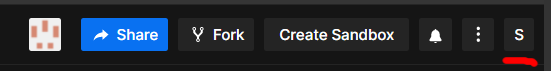

# userscripts

### Codesandbox

Add a button at the end of the toolbar. Use this button to copy the markdown text of the Codesandbox share button. Without this button, you have to:

* Click several times (`Share` > `Embeded` > `Other Sharing Buttons` > *Copy the md text*) to get the markdown text (annoyingly slow).
* Jump to the default file when clicking the shared link. Usually it's the `index.tsx` file while I want it to jump directly to the demo file so the user can get the point quicker.

This button help me save several seconds when answering questions on Stackoverflow, where the first answer is more likely to earn the intial upvote which is a pretty big deal.
